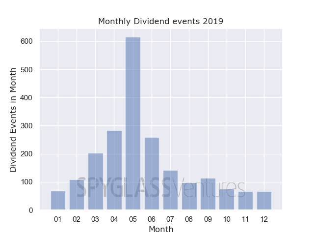
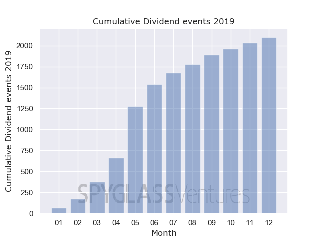

# sgv-dividend-graphs
Python script to read in .csv of dividend dates, group them by month and output distribution and cumulative graph
Dividendenkalender 2019 – Wann werden Dividenden gezahlt?
Im April, Mai und Juni ist Dividendensaison. Das ist bekannt. Zwecks Liquiditätsplanung haben wir die Auszahlungstermine genauer analysiert. Fig. 1 zeigt die monatlichen Dividendenzahlungen.

  

Fig. 1: Monatliche Dividendenzahlungen (Datenquelle: www.finanzen.net), n=2098
Die Grafik zeigt deutlich, dass der Monat Mai der absolute Höhepunkt für Dividendenzahlungen ist. Es folgen die Monate April und Juni.

  

Fig. 2: Kumulative Dividendenzahlungen (Datenquelle: www.finanzen.net), n=2098
Kumuliert betrachtet illustriert Fig. 2, dass bis Ende August der grösste Teil (1889 der 2098 untersuchten Firmen, oder 90%) aller Dividenden geflossen sind. Der Zeitpunkt der Zahlung hat insbesondere dann eine hohe Relevanz für Investoren, wenn ein erheblicher Teil der Lebenshaltungskosten über Dividenden finanzieren wird. Der Zeitpunkt der Auszahlung ist daher höchst relevant aus Liquiditätsperspektive.

In gewisser Hinsicht ärgerlich sind die Abzüge (z.B. 26.375% für die Dt. Quellensteuer), zu der die Depotbanken verpflichtet sind. Glücklicherweise ist ein Teil dieser Abzüge rückforderbar. Gerne hilft Ihnen Spyglass hierbei.
